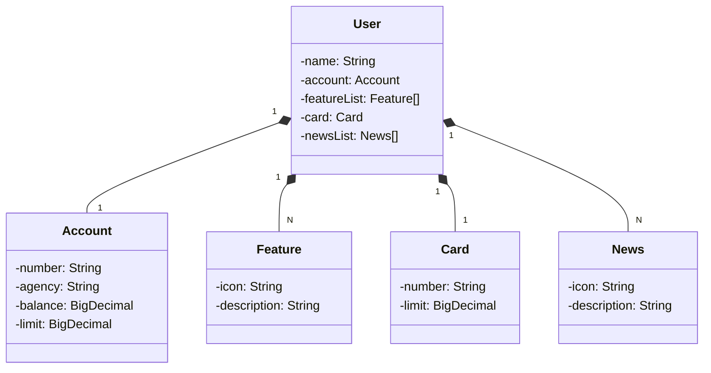

# RESTful API - Conta Bancária | DIO
Spring Boot 3 | MySql | Railway

## Diagrama de Classes UML:

## Perfis de usuário
Dois perfis de usuário:
- `application-dev.yaml`:  
  Banco de Dados em memória (H2 Database)
- `application-prd.yaml`:  
  Banco de Dados no docker do Railway (MySql)

## Deploy
- Hospedado com Railway: (removido 💸)
  
- Documentado com OpenApi (Swagger):
  

