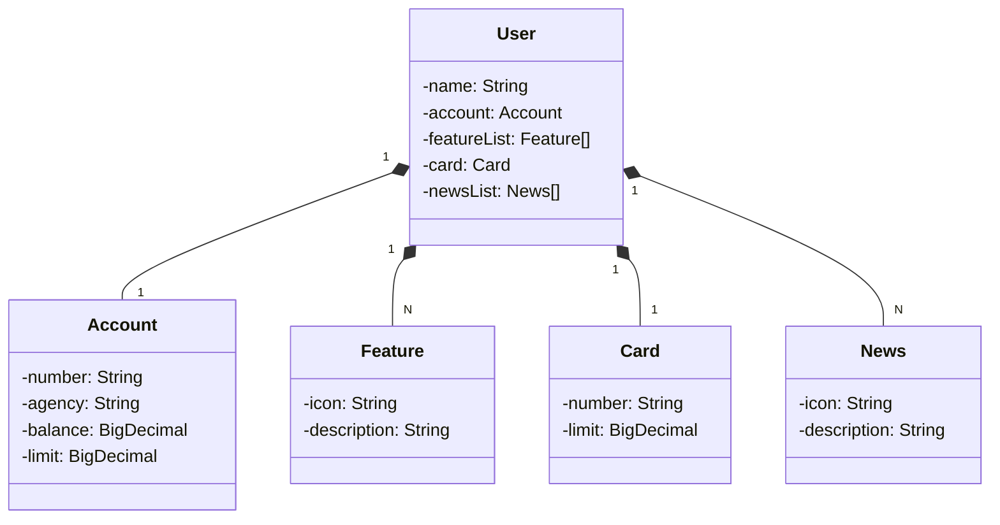

# RESTful API - Conta Bancária | DIO
SpringBoot3 | MySql | Railway

## Diagrama de Classes UML:

## Perfis de usuário
Dois perfis de usuário:
- `application-dev.yaml`
- `application-prod.yaml`

## Deploy
- Hospedado com Railway
- Banco de Dados MySql
- Documentado com OpenApi (Swagger)